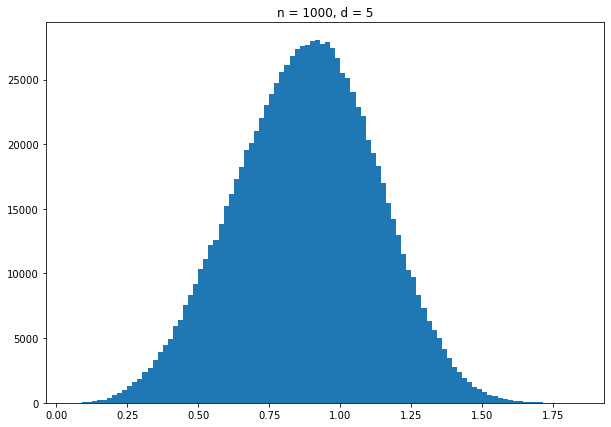
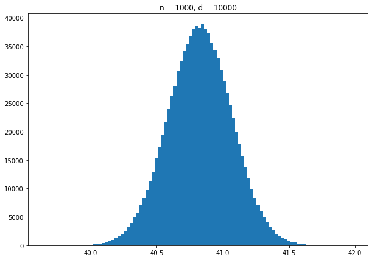
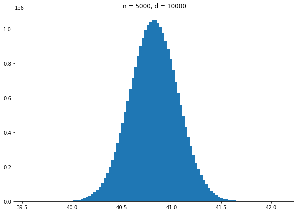

# Parzen_Window_KNN_Models
Implementation of a Parzen Window model with different window sizes, and a **gaussian kernel** on the **Ted Talks** dataset, both **from scratch**, and by using **scikit learn**, and investigation of the **curse of dimensionality** on a dataset of random points in the x-y plane, and comparing the results to **KNN** and **Parzen Window** methods.

<h2>Parzen Window From Scratch:</h2>

First, I read the **duration column** in the **csv file** and put it into a list:

Then, I define a function to calculate the **density score** with the gaussian kernel. The function in the code above:

```ruby
def density_score (x, data, h)
```

I calculate the density score for all our data and find the **distribution**. The results is as below:


Now I calculate the distribution with **different window sizes**.

<h4>h = 20</h4>


<h4>h = 50</h4>


<h4>h = 100</h4>


As it can be seen, the distribution becomes **smoother** by increasing the window size.

<h2>Parzen Window with scikit-learn:</h2>

First, I split **test** and **train** data. Then, I define different parzen window sizes and plot them, using the **KDE** model. The results are as below:

```ruby
bandwidths = [10, 20, 50, 100]
```

<h4>h = 10</h4>


<h4>h = 20</h4>


<h4>h = 50</h4>


<h4>h = 100</h4>


Then, I test the data with different values of **n**:

```ruby
for n in range(250,len(duration_list),250):
    x_train_new = x_train[0:n]
    kde_model = KernelDensity(kernel='gaussian', bandwidth=10)
    kde_model.fit(x_train_new)
```

<h4>n = 250</h4>


<h4>n = 750</h4>


<h4>n = 1250</h4>


<h4>n = 2500</h4>


Evaluating the **convergence** of different models:


Comparing the results of the first and second part:

As it can be seen in both implementations, by increasing the size of the window, our model becomes smoother, which is expexted according to what we have learned in the class.

Also it can be seen that by increasing the size of our train data, the model becomes **more similar** to the actual model and also **smoother**, since more data is used for the model to learn.

<h2>Curse of dimensionality:</h2>

<h3>Part A:</h3>

Implementation of 1000 random n dimensional data points, and finding the distance between each pair of them. Distance calculation is done by using cdist as below:

```ruby
distance = cdist(numbers, numbers, metric = 'euclidean')
```

The **histogram** of the distances is shown below:

<h4>n = 1000 , d = 5</h4>



<h4>n = 1000 , d = 2000</h4>


<h4>n = 1000 , d = 5000</h4>


<h4>n = 1000 , d = 10000</h4>



Now I fix the dimension to 10000, and check different values for the **length of the vector**:

<h4>n = 2000 , d = 10000</h4>


<h4>n = 5000 , d = 10000</h4>



<h3>Part B:</h3>

<h4>Comparing the results to KNN algorithm:</h4>

In **KNN** method, we fix the size of k, and increase the size window until we have k samples inside it. As it can be seen in the above implementations, by increasing the number of samples in large dimensions, the computations become very **complex** and take a **long time**. So, in these kinds of datasets, it's better to **fix the number of samples** and **increase the size of the window**, because the computations are going to be a lot **faster**.

The relation between this project and the curse of dimensionality, is the **huge amount of computations** that occur when **increasing the dimensions** in the problem. In fact, the number of the samples need to be increased so that the **density** of data stays the same.
