# Parzen_Window_Models
Implementation of a Parzen Window model with different window sizes, and a **gaussian kernel** on the **Ted Talks** dataset, both **from scratch**, and by using **scikit learn**.

<h2>Parzen Window From Scratch:</h2>

First, I read the **duration column** in the **csv file** and put it into a list:

Then, I define a function to calculate the **density score** with the gaussian kernel. The function in the code above:

```ruby
def density_score (x, data, h)
```

I calculate the density score for all our data and find the **distribution**. The results is as below:

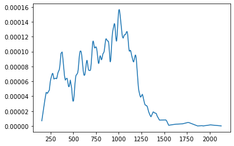

Now I calculate the distribution with **different window sizes**.

<h4>h = 20</h4>

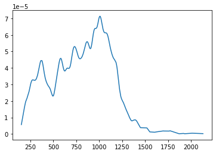

<h4>h = 50</h4>

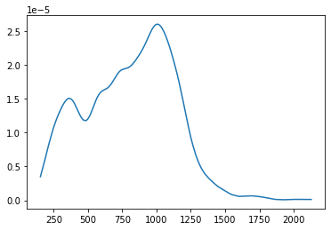

<h4>h = 100</h4>

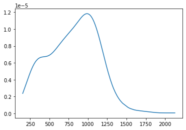

As it can be seen, the distribution becomes **smoother** by increasing the window size.

<h2>Parzen Window with scikit-learn:</h2>

First, I split **test** and **train** data. Then, I define different parzen window sizes and plot them, using the **KDE** model. The results are as below:

```ruby
bandwidths = [10, 20, 50, 100]
```

<h4>h = 10</h4>

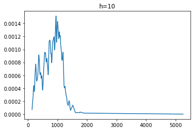

<h4>h = 20</h4>

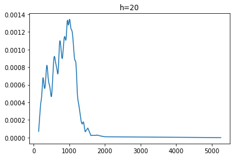

<h4>h = 50</h4>

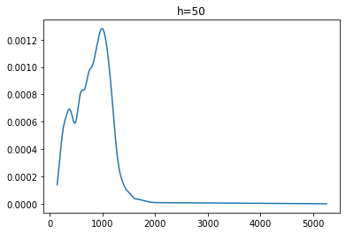

<h4>h = 100</h4>

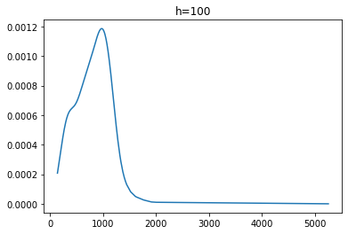

Then, I test the data with different values of **n**:

<h4>n = 250</h4>

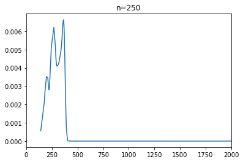

<h4>n = 750</h4>

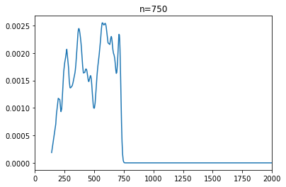

<h4>n = 1250</h4>

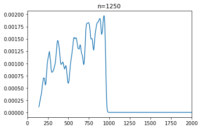

<h4>n = 2500</h4>

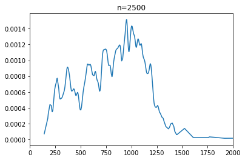

Evaluating the **convergence** of different models:

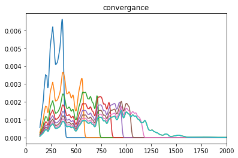

Comparing the results of the first and second part:

As it can be seen in both implementations, by increasing the size of the window, our model becomes smoother, which is expexted according to what we have learned in the class.

Also it can be seen that by increasing the size of our train data, the model becomes **more similar** to the actual model and also **smoother**, since more data is used for the model to learn.
